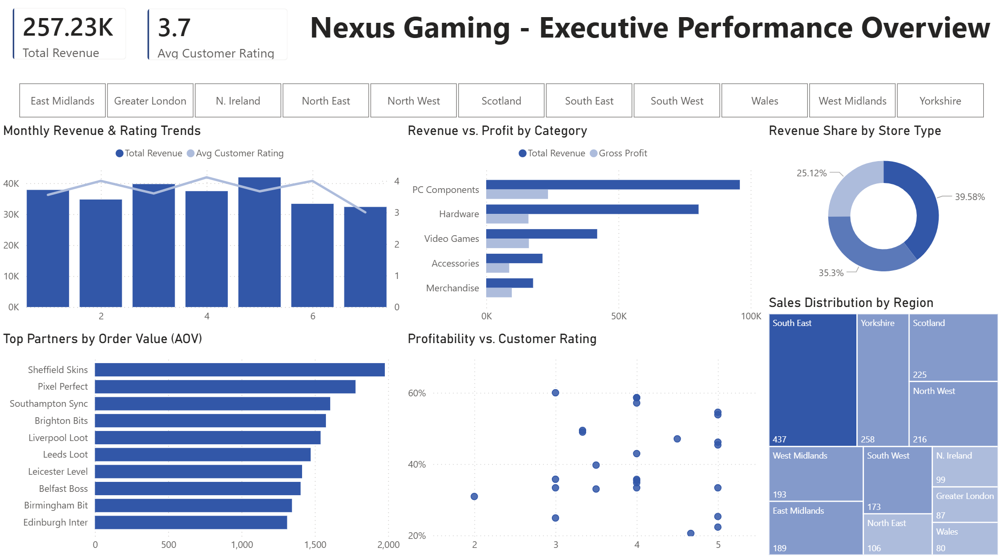

# nexus-gaming-b2b-analysis

**Project Status:** **COMPLETE**. Check the `04_Output` folder for the interactive dashboard in Microsoft Excel and Power BI

Advanced B2B Supply Chain &amp; Retailer Performance Analysis for Nexus Gaming. Built with Excel (Power Query &amp; Data Modelling) and Power BI.

Nexus Gaming B2B: Supply Chain & Retailer Performance Analysis

## **1. Project Overview**
   
Nexus Gaming is a UK-based B2B wholesaler specialising in gaming hardware, software, and merchandise. This project demonstrates a complete data analysis lifecycle—from raw data ingestion to professional business intelligence reporting.

The goal is to provide the management team with insights into distribution efficiency, client profitability, and product performance across 10 key retail partners in the UK.

## **2. Business Results & Insights**

**Phase 1: Microsoft Excel - Key Business Insights**

# Nexus Gaming - B2B Performance Dashboard

**Revenue & Profit Engines:** The South East and Yorkshire are the primary drivers of profitability. The South East remains the most critical territory, maintaining high Gross Profit margins alongside peak order volumes.

**Product Performance:** The RTX 4070 Super is the top-performing hardware in the Midlands and South East. However, its lower penetration in Northern regions suggests a clear opportunity for targeted sales growth.

**Regional Satisfaction Trends:** While national customer satisfaction peaks in April, a regional deep-dive shows the South East achieves its highest ratings in January and February, suggesting a different seasonal efficiency cycle for our largest market.

**Service Bottlenecks:** Data show July as the month with consistently the lowest feedback ratings across all regions. This trend follows the high-volume period in May, indicating a potential service lag or supply chain strain during post-peak recovery.

**Phase 2: Power BI - Key Business Insights**

# Nexus Gaming - B2B Performance Dashboard

**Financial Health:** What is the Total Revenue vs. Gross Profit across all categories?

- The business achieved a Total Revenue of £257.23K.
- PC Components is the primary financial driver, contributing the highest revenue and gross profit.
- All categories maintain a positive profit margin, though Merchandise has the smallest impact on the overall bottom line.

**Distribution Reach:** Which UK regions are driving the highest order volumes?

- The South East is the clear leader in distribution, accounting for 437 units sold.
- Yorkshire (258 units) and Scotland (225 units) follow as key secondary markets.
- The lowest volume was recorded in Wales with 80 units sold.

**Client Segmentation:** Who are our top-performing retail partners based on Average Order Value (AOV)?

- Sheffield Skins and Pixel Perfect are the top-performing partners, consistently placing the highest-value orders.
- Their high AOV suggests a successful focus on premium hardware lines rather than lower-cost accessories.

**Operational Quality:** Profitability vs. Customer Satisfaction

- Analysis shows a positive correlation between profitability and quality: most high-margin products (40%+) maintain strong Customer Ratings between 3.5 and 5.0.
- Products with ratings below 3.0 are outliers, suggesting that high profitability does not come at the expense of customer satisfaction across the majority of the portfolio.

## **3. Technical Stack**
This project is divided into two distinct phases to show a progression of analytical skills:

**Phase 1: Microsoft Excel**
- Data Sourcing: Connecting to 4 separate raw data files (Dimensions & Facts).
- Power Query: Cleaning "dirty" data (inconsistent casing, date formats, and trailing spaces).
- Data Modelling: Establishing relationships between tables to create a "Star Schema" in Excel.
- Advanced Analytics: Using Power Pivot and complex formulas (IFS, XLOOKUP, measures) for financial logic.
- Interactive Dashboard: A dynamic visual interface with Slicers and Timelines.

**Phase 2: Power BI**
- Migration of the Excel Data Model to Power BI Desktop.
- Advanced DAX (Data Analysis Expressions) for time-intelligence reporting.
- High-level interactive visualisations and automated reporting.

## **4. Data Architecture**
The project utilises a Relational Data Model consisting of:

- Dim_Products: Master list of products, categories, and costs.
- Dim_Clients: Details of UK retail partners.
- Fact_Sales: Transaction records from the 2025 fiscal year.
- Fact_Feedback: Customer satisfaction data linked to sales transactions.
