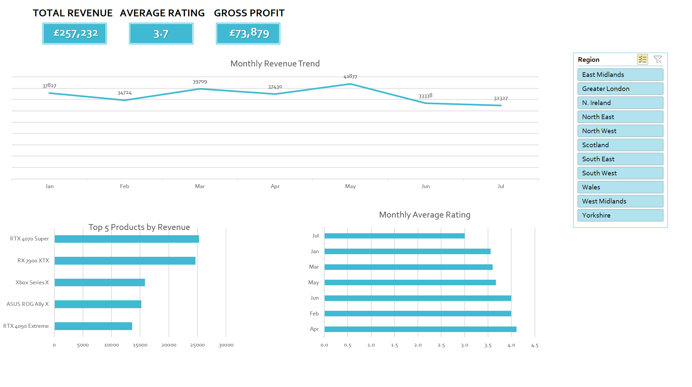

# nexus-gaming-b2b-analysis

# Nexus Gaming - B2B Performance Dashboard

> **Project Status:** Excel & Power Pivot is **COMPLETE**. Check the `04_Output` folder for the interactive dashboard.

Advanced B2B Supply Chain &amp; Retailer Performance Analysis for Nexus Gaming. Built with Excel (Power Query &amp; Data Modelling) and Power BI.

Nexus Gaming B2B: Supply Chain & Retailer Performance Analysis

1. Project Overview
   
Nexus Gaming is a UK-based B2B wholesaler specialising in gaming hardware, software, and merchandise. This project demonstrates a complete data analysis lifecycle—from raw data ingestion to professional business intelligence reporting.

The goal is to provide the management team with insights into distribution efficiency, client profitability, and product performance across 10 key retail partners in the UK.

2. Business Results & Insights

Phase 1: Key Business Insights

Revenue & Profit Engines: The South East and Yorkshire are the primary drivers of profitability. The South East remains the most critical territory, maintaining high Gross Profit margins alongside peak order volumes.

Product Performance: The RTX 4070 Super is the top-performing hardware in the Midlands and South East. However, its lower penetration in Northern regions suggests a clear opportunity for targeted sales growth.

Regional Satisfaction Trends: While national customer satisfaction peaks in April, a regional deep-dive shows the South East achieves its highest ratings in January and February, suggesting a different seasonal efficiency cycle for our largest market.

Service Bottlenecks: Data identifies July as the month with the consistently lowest feedback ratings across all regions. This trend follows the high-volume period in May, indicating a potential service lag or supply chain strain during post-peak recovery.

3. Technical Stack
This project is divided into two distinct phases to show a progression of analytical skills:

Phase 1: Microsoft Excel (Current Phase)
- Data Sourcing: Connecting to 4 separate raw data files (Dimensions & Facts).
- Power Query: Cleaning "dirty" data (inconsistent casing, date formats, and trailing spaces).
- Data Modelling: Establishing relationships between tables to create a "Star Schema" in Excel.
- Advanced Analytics: Using Power Pivot and complex formulas (IFS, XLOOKUP, measures) for financial logic.
- Interactive Dashboard: A dynamic visual interface with Slicers and Timelines.

Phase 2: Power BI (Upcoming)
- Migration of the Excel Data Model to Power BI Desktop.
- Advanced DAX (Data Analysis Expressions) for time-intelligence reporting.
- High-level interactive visualisations and automated reporting.

4. Data Architecture
The project utilises a Relational Data Model consisting of:

- Dim_Products: Master list of products, categories, and costs.
- Dim_Clients: Details of UK retail partners.
- Fact_Sales: Transaction records from the 2025 fiscal year.
- Fact_Feedback: Customer satisfaction data linked to sales transactions.
